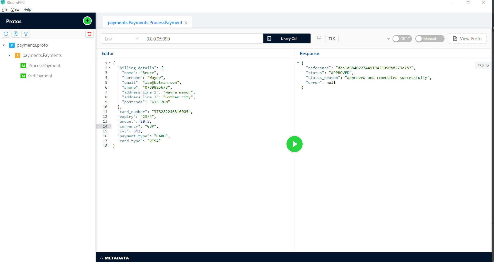
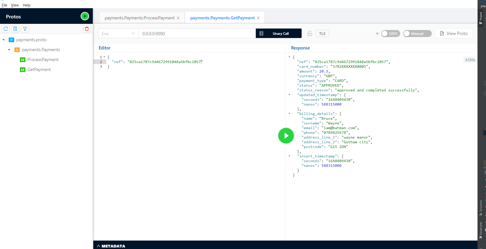

# Payments Gateway

**About** <br />
The payments-gateway is a gRPC server implementation that allows 
a merchant to 
* Process a payment through your payment gateway.
* Retrieve details of a previously made payment.

The payment gateway repo also contains configuration for a Bank simulator that is part
of the payments lifecycle and used for validating and authorizing payments.

The Bank simulator was created using [MockServer](https://www.mock-server.com/)
Since a simulator would return specific outputs for a given input as well as it would being
an external service, MockServer was used due to its easy configuration and simplicity. 
See `config/initializerJson.json` for the configuration. The actual server is run in a docker container.

The payment-gateway service also interacts with a Postgres db that is defined in
`scripts/db/init.sql`. The db s responsible for storage of payment details. 

**Assumptions** <br />
* Store payments in a DB and not within application memory. A Postgres database running on a docker image was used. 
* The Bank simulator is responsible for auth and validation and per request they return a status code and message regarding
with regard to particular 2-digit code returned. This is defined on there side and we have a small helper function decoding 
the status codes in to one of four status as defined in the protos definitions. 
* Before saving the payment/transaction we first need to at a minimum pass card validation as we don't want to save invalid 
* data to the DB

**How it Works** <br />
In order to run the payments-gateway service, you first need to run the docker containers
running the mock-service and well as th acquiring bank simulator.
This is achieved by running the docker-compose.yaml file as follows

```shell
docker-compose up
```

This spins up containers for all the required services that the payment gateway will interact with.
Thereafter, you can run the payments-gateway code either from your favourite IDE or via


***Example*** <br />
Process a payment



Retrieve a payment




```shell
$ go build cmd/payments-gateway/main.go

$ go run cmd/payments-gateway/main.go

{"level":"info","msg":"Starting payments-gateway gRPC server","port":9090,"time":"2022-03-27T22:52:48+01:00"}

```
## Upcoming Changes and Features
***Integration Tests*** <br />
Create test DB and test tables of the same schema within the postgres service running in the docker container. Then create 
a new instance of the client  connecting to the test DB in which to run go tests created for the storage package. 
These are more reliable and realistic as compared to mock tests.
***Submit method in the Bank simulator*** <br />
Once all transactions are authorized, at the end of the day we should submit all of them to find out if they had been 
paid/completed. Some work has been done for this in  the bank package already.
***Clean up code in regard to TODO's left in the codebase*** <br />
Some examples here include optimizing parameters in functions, adding concurrency as to calling methods in the bank 
simulator and saving to the database

## Generating the go files from the protos definition
```shell
protoc --go_out=. --go_opt=paths=source_relative --go-grpc_out=. --go-grpc_opt=paths=source_relative protos/payments.proto
```

## Running tests
```shell
go test ./...
```

## Packages

`/cmd`: main.go

`/aquiring-bank`: interface that has a client implementation for the acquiring bank simulation

`/server`: gRPC server implementation

`/protos`: protobuf definitions and generated go files for the gRPC server

`/storage`: Storage interface

`/storage/postgres`: Postgres db client implementation
